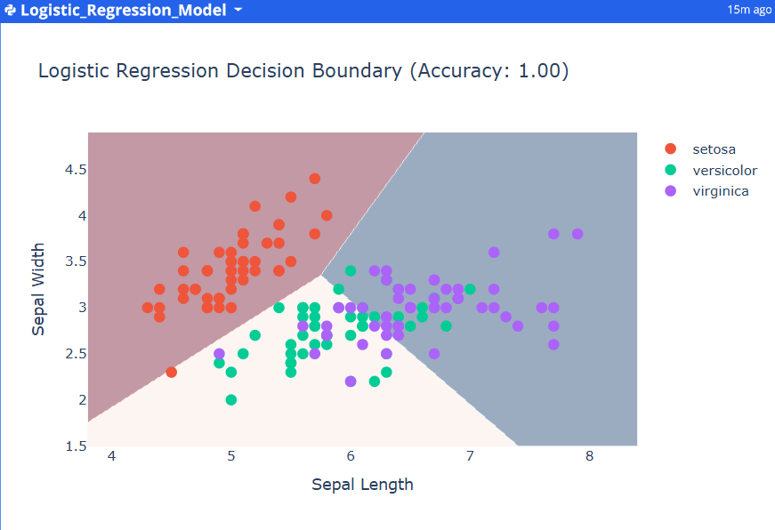

# PREDICTIVE-ANALYSIS-USING-MACHINE-LEARNING

*COMPANY*: CODTECH IT SOLUTIONS

*NAME*: PABITRA SAHOO

*INTERN ID*: CT04DF1804

*DOMAIN*: DATA ANALYST

*DURATION*: 4 WEEKS

*MENTOR*: NEELA SANTOSH

## TASK DESCRIPTION

📌 Project Overview
This project was developed as part of my Data Analyst internship task to build a machine learning classification model that predicts outcomes based on a given dataset. I used the famous Iris dataset, which includes measurements of iris flowers (sepal length, sepal width, etc.) and their species (Setosa, Versicolor, Virginica).

The objective was to:

Perform feature selection

Train a classification model

Evaluate the model and visualize the results

📁 Dataset
The dataset was taken in .csv format and loaded using Pandas. It includes:

Sepal Length

Sepal Width

Petal Length

Petal Width

Species (target variable)

🔧 Tools & Libraries Used
Python, Pandas

Scikit-learn – Model training and evaluation

Plotly Express – Visualization

Jupyter Notebook – For development and documentation

🔍 Workflow Summary
Data Preprocessing:

Checked for missing values and outliers

Converted categorical labels to numerical using LabelEncoder

Model Training:

Implemented Logistic Regression

Achieved 100% accuracy on test data (as shown in the decision boundary plot)

Evaluation:

Used accuracy, classification report, and visual decision boundaries

📊 Dashboard Output

The chart clearly shows how the model separates the classes with distinct decision boundaries using Sepal Length and Sepal Width.

✅ Outcome
The project demonstrates the complete pipeline from loading data to evaluating a classification model, along with interactive visualization. It strengthened my practical understanding of supervised learning and data visualization.
